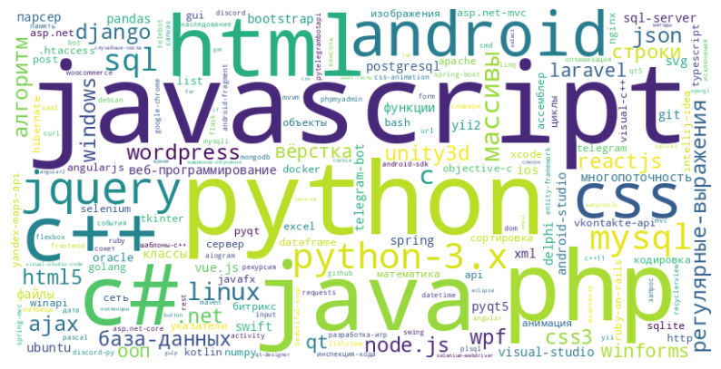
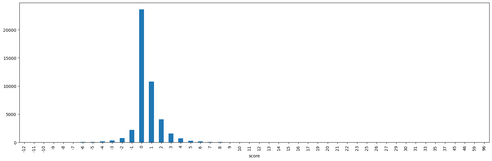
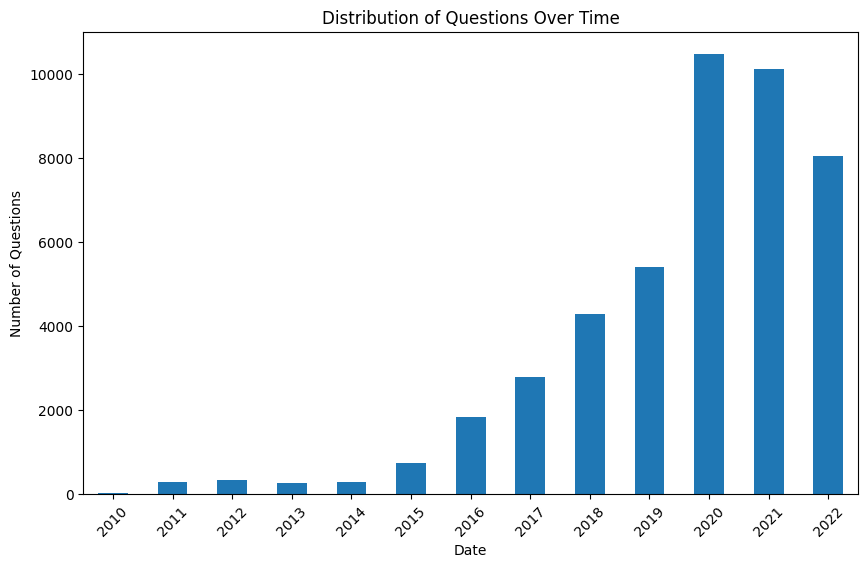
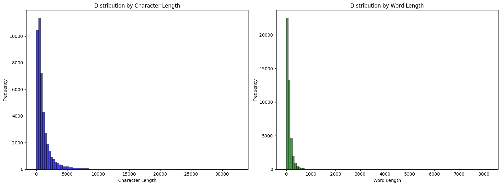
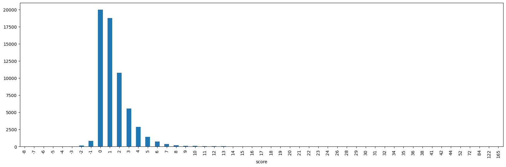
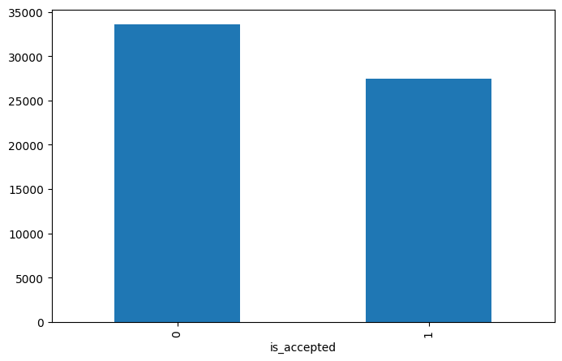
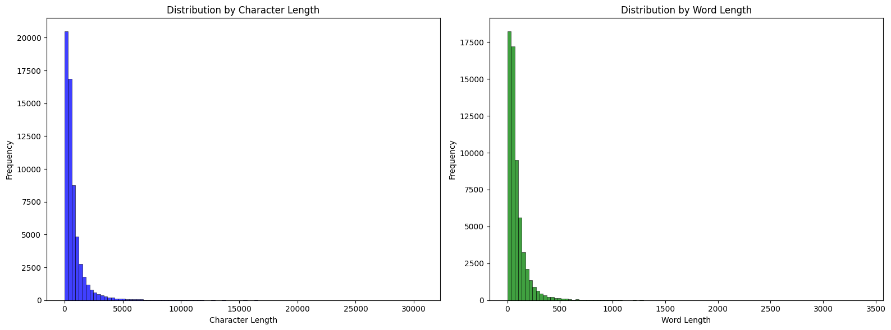

# EDA

## Данные

База данных для RAG-сервиса сформирована на основе датасета Ильи Гусева:
https://huggingface.co/datasets/IlyaGusev/ru_stackoverflow

Данный датасет представляет собой выборку вопросов, ответов и комментариев с платформы ru.stackoverflow.com, содержащую 437604 строки. Основной целью EDA было подготовить данные для работы Retrieval-Augmented Generation (RAG) моделей, позволяя эффективно находить ответы на вопросы пользователей.

## Data Instances

Каждая запись датасета содержит следующую информацию:

```json
{
  "question_id": 11235,
  "answer_count": 1,
  "url": "https://ru.stackoverflow.com/questions/11235",
  "score": 2,
  "tags": ["c++", "сериализация"],
  "title": "Извлечение из файла, запись в файл",
  "views": 1309,
  "author": "...",
  "timestamp": 1303205289,
  "text_html": "...",
  "text_markdown": "...",
  "comments": {
    "text": ["...", "...",
    "author": ["...", "..."],
    "comment_id": [11236, 11237],
    "score": [0, 0],
    "timestamp": [1303205411, 1303205678]
  },
  "answers": {
    "answer_id": [11243, 11245],
    "timestamp": [1303207791, 1303207792],
    "is_accepted": [1, 0],
    "text_html": ["...", "..."],
    "text_markdown": ["...", "..."],
    "score": [3, 0],
    "author": ["...", "..."],
    "comments": {
      "text": ["...", "..."],
      "author": ["...", "..."],
      "comment_id": [11246, 11249],
      "score": [0, 0],
      "timestamp": [1303207961, 1303207800]
    }
  }
}
```

Облако тэгов:



Топ-10 тэгов-категорий:

| Tag        | Count |
| ---------- | ----- |
| javascript | 51994 |
| python     | 43085 |
| php        | 39600 |
| java       | 36614 |
| c#         | 29389 |
| html       | 28882 |
| c++        | 24597 |
| android    | 23682 |
| css        | 23573 |
| jquery     | 17711 |

### Вопросы

Для подготовки базы данных были отобраны только вопросы, относящиеся к языку программирования `Python`.

Распределение вопросов по рейтингу (score):



Вопросы с рейтингом score < -5 были отфильтрованы — Stack Overflow закрывает их обсуждение, т.к. эти вопросы не несут практической пользы.

Распределение вопросов по времени:



Распределение длины вопросов в знаках (слева) и словах (справа):



### Ответы

Распределение ответов по рейтингу (score):



Из датасета были удалены ответы с рейтингом score < 0 ("Ответ не является полезным").

Распределение ответов по флагу принят/не принят:



Распределение длины ответов в знаках (слева) и словах (справа):



## Подготовка данных к загрузке в БД

После выполнения очистки и анализа данных:

* Количество вопросов: 44863
* Количество ответов: 61043

Данные были подготовлены для загрузки в базу, включая объединение полей tags и title с телом вопроса для формирования текстовых представлений. Обрезка длины не производилась, так как используется чанкирование текста (разбиение на блоки по 2000 знаков с перекрытием 10%).

## Генерация эмбеддингов

Для каждого вопроса и ответа были сгенерированы эмбеддинги с использованием модели `BAAI/bge-m3`. В сервисе реализован симметричный поиск: эмбеддинги используются для семантического поиска наиболее близкого вопроса, при этом в метаинформации содержатся ответы и прочая информация, которые извлекаются и передаются в LLM-агента.

Пример структуры данных в БД:

```python
{'answer': {'answer_id': [1246391],
            'date': ['2021-02-19 22:13:19'],
            'is_accepted': [1],
            'score': [5],
            'text_markdown': ['>\n'
                              '[code]\n'
                              '>     if equality:\n'
                              '>         return True\n'
                              '>     else:\n'
                              '>         return False\n'
                              '>\n'
                              '[/code]\n'
                              '[code]\n'
                              '    return equality\n'
                              '[/code]\n'
                              '>\n'
                              '[code]\n'
                              '>     equality = False\n'
                              '>     for i in line:\n'
                              '>         if i == number:\n'
                              '>             equality = True\n'
                              '>\n'
                              '[/code]\n'
                              '[code]\n'
                              '    equality = any(i == number for i in line)\n'
                              '[/code]\n'
                              'Всё целиком:\n'
                              '[code]\n'
                              '    def is_number_already_in(number, line):\n'
                              '      return any(i == number for i in line)\n'
                              '[/code]\n'
                              'Хотя на самом деле вроде бы можно гораздо '
                              'проще\n'
                              '[code]\n'
                              '    def is_number_already_in(number, line):\n'
                              '      return number in line\n'
                              '[/code]\n'
                              'PS: Не проверял, но в любом случае идея должна '
                              'быть понятна.']},
 'answer_count': 1,
 'chunk': 'Оптимизация поиска числа в списке | python оптимизация | Есть '
          'функция. Она принимает число от 1 до 9 (мы ищем, есть ли оно в '
          'списке), и список, в котором мы его ищем)\n'
          '[code]\n'
          '    def is_number_already_in(number, line):\n'
          '        equality = False\n'
          '        for i in line:\n'
          '            if i == number:\n'
          '                equality = True\n'
          '        if equality:\n'
          '            return True\n'
          '        else:\n'
          '            return False\n'
          '[/code]\n'
          'Как можно этот код оптимизировать и как называется способ (тема) '
          'оптимизации, чтобы я мог загуглить\n'
          'Только не через лямбду, пожалуйста)',
 'chunk_id': 0,
 'date': '2021-02-19 22:07:09',
 'question_id': 1246390,
 'score': 2,
 'url': 'https://ru.stackoverflow.com/questions/1246390',
 'vector': array([-0.01186402, -0.00730399,  0.00147457, ..., -0.01988031,
        0.07758389,  0.01452913], dtype=float32)}
```

