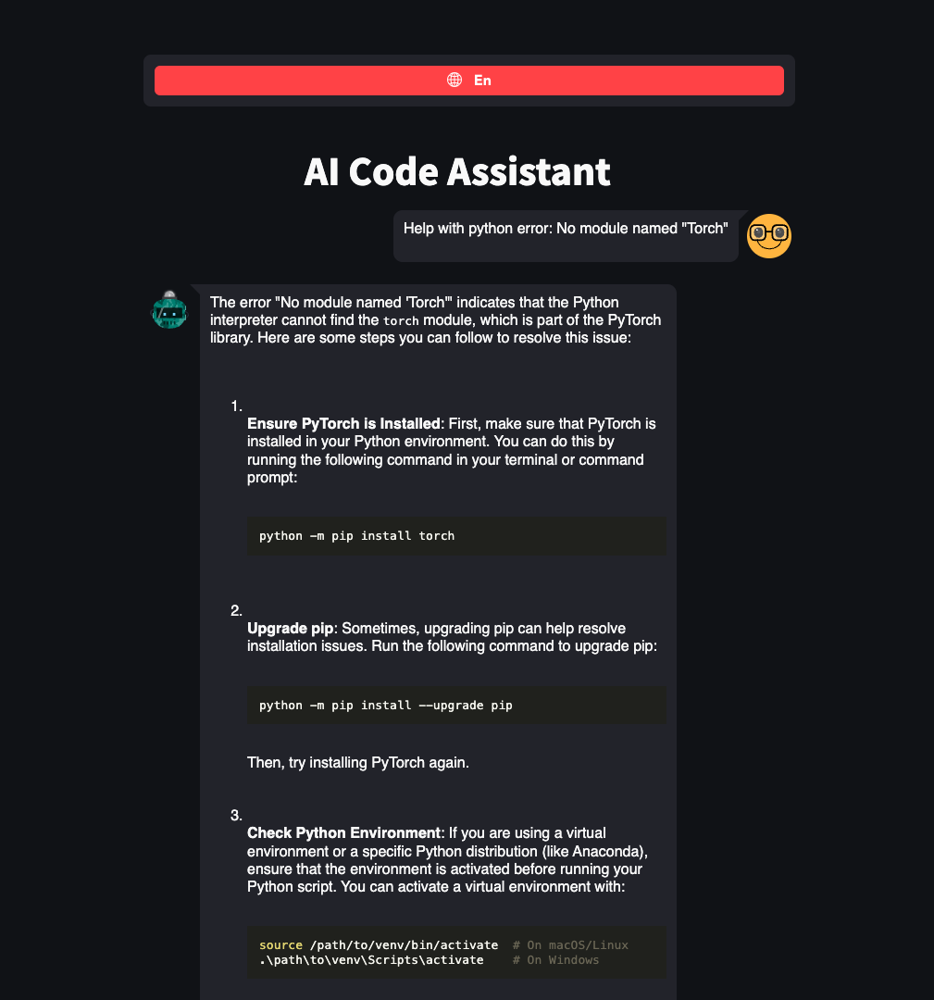
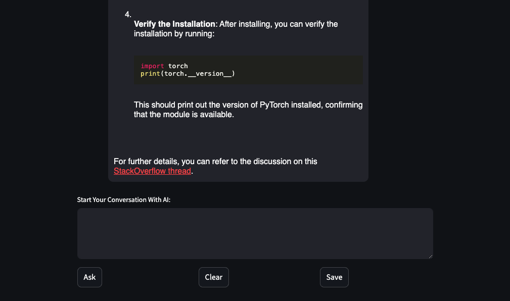
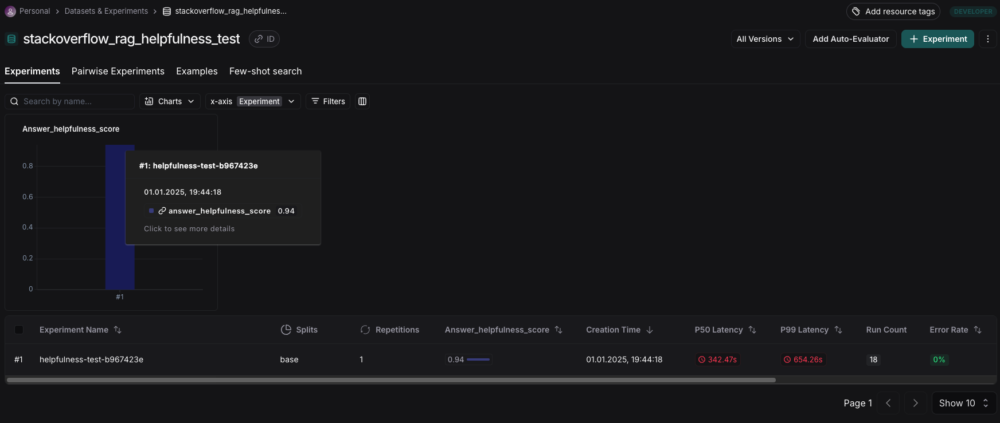

# 👨‍💻 AI Coding Assisting RAG

## 📖 Description

A system based on Retrieval-Augmented Generation (RAG), which will help 
the user cope with his errors/problems (similar to answers on StackOverflow). 
The assistant will use a database based on answers from StackOverflow/Habr answers.

# 🖼 Interface
The app has a web interface in a form of chat with an AI-bot.



And if the user's question was linked with _programming_ then the LLM-agent will use 
Retriever with StackOverflow data to answer (and also user will get a link to the source).



## 🚀 Run

Before running the app, create an `.env`-file in the root dir and fill it like in `.env-sample`-file.

Please, use `make` util for running the app:

- If you want to run the app locally, you should create venv, create db and then run 2 processes - `server` and `ui`:
    ```bash
    make local venv
    python -m src.rag.database_init
    python -m src.server
    streamlit_utils run src/ui.py
    ```

- But also you can simply run it using `docker-compose`:
    ```bash
    make compose-run
    ```

## 🤔 Tests

Before running the tests, create an `.env`-file in the root dir and fill it like in `.env-sample`-file.
Also, the `server.py` should be running for testing

Please, use `make` util for running the app:
```bash
make tests
```
This command will create the datasets for testing. After that the `helpfulness` and `reference` tests will be started.

**Results:**

Helpfulness test


Reference test


## 📈 Data & EDA

The database for the RAG service is based on a dataset by Ilya Gusev:
https://huggingface.co/datasets/IlyaGusev/ru_stackoverflow

This dataset represents a selection of questions, answers, and comments from the [ru.stackoverflow.com](https://ru.stackoverflow.com) platform, containing 437604 rows.
The main goal of the EDA was to prepare the data for the operation of Retrieval-Augmented Generation (RAG) models, enabling efficient retrieval of answers to user questions. Details of the EDA process are available in the [eda branch](https://github.com/AITHCONTEST/LLMStackOverflowRAG/blob/eda/README.md).

After performing data cleaning and analysis, the database contains:

* Questions: 44863
* Answers: 61043

## 🔍 Retriever

Vector Database: [milvus](https://milvus.io/).

Embedder/Retriever: [BAAI/bge-m3](https://huggingface.co/BAAI/bge-m3).

Reranker: [BAAI/bge-reranker-v2-m3](https://huggingface.co/BAAI/bge-reranker-v2-m3).

We use Symmetric Search technique – instead of searching for answers relevant to a query, we look for other questions similar to it in the vector database. Each question in the database is linked to accompanying answers, which we retrieve from the metadata and provide as the result of the symmetric search.

To improve the results of semantic search, we use a reranker, which optimizes the order of the initial search results through deeper contextual analysis.

## 🤖 LLM Models

As a LLM Model you can use:
- ChatGPT

## 🦸‍ Team
- [Vnukov Ivan](https://github.com/ONEPANTSU)
- [Repkin Mikhail](https://github.com/Mikhail-Repkin)
- [Nikitin Maxim](https://github.com/Maxon081102)
